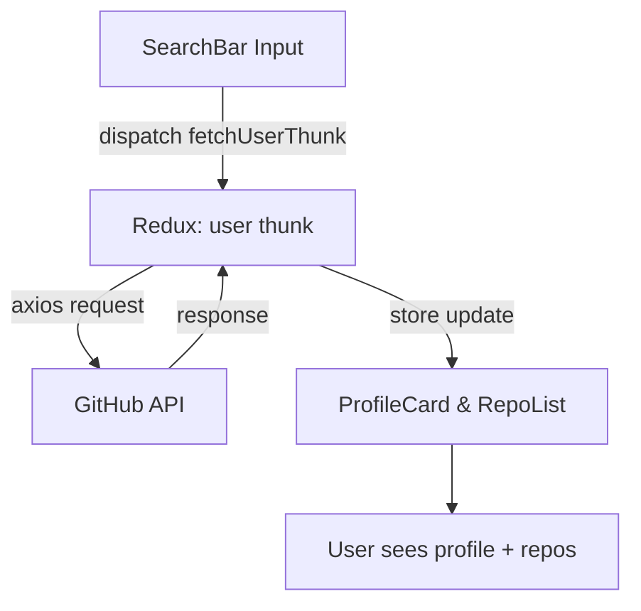
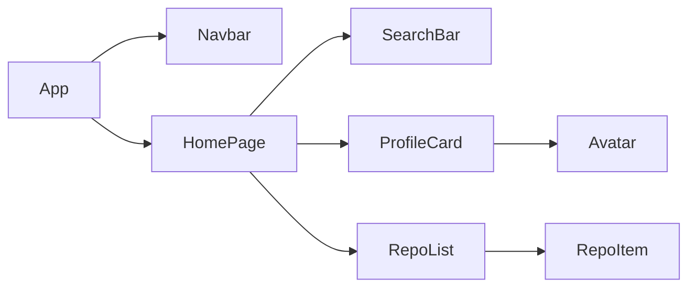

# GitHub User Finder

**GitHub User Finder** — bu Vite + React + Redux Toolkit + MUI (Material UI) asosidagi kichik lekin production-ga yaqin test loyihadir. Loyihaning maqsadi: foydalanuvchi GitHub username'ini kiritsa, uning profil va public repositorylarini chiroyli, responsiv interfeysda ko‘rsatish.


**Ma'lumot:** Loyihaning asosiy vazifasi — GitHub API (`https://api.github.com`) orqali foydalanuvchi ma'lumotlarini olish va ularni UI orqali ko‘rsatish.

**Ma'lumot oqimi (qisqacha):** `SearchBar` → `dispatch(fetchUserThunk)` → `Redux store` (user slice) → `ProfileCard` va `RepoList` komponentlari.

**Asosiy talablar:**

* React (Hooks)
* Redux Toolkit (createSlice, createAsyncThunk)
* Material UI (MUI v6+)
* Axios (API chaqiriqlar)
* Debounce (qidiruv uchun)
* LocalStorage caching (ixtiyoriy)
* Responsive dizayn

---

## 📂 Fayl tuzilishi (primary)

```
src/
├── app/
│   ├── store.js
│   ├── rootReducer.js
│   └── hooks.js
├── modules/
│   ├── user/
│   ├── repo/
│   ├── search/
│   └── theme/
├── components/
│   ├── Navbar/
│   └── UI/
├── pages/
│   └── HomePage.jsx
├── services/
│   └── axiosClient.js
├── utils/
└── main.jsx
```

Har bir modul (feature) `api`, `redux` (slice + thunks), `components` va `hooks` kabi kichik kataloglarga bo‘linadi.

---

## 🧩 Xususiyatlar (Features)

* Foydalanuvchi qidiruvi (debounced input)
* GitHub profil ko‘rinishi (avatar, bio, followers, following, repos count)
* Repository ro‘yxati (noma, description, star count, link)
* Loading va Error holatlari
* Dark / Light theme toggle (MUI Theme)
* LocalStorage cache (API chaqiriqlarni kamroq qilish uchun)
* Responsive layout (mobile → desktop)

---

## ⚙️ Texnik stack

* Runtime: Node.js
* Bundler: Vite
* Frontend: React + Hooks
* State: Redux Toolkit (slices + thunks)
* UI: Material UI (MUI)
* HTTP: Axios

---

## O‘rnatish va ishga tushirish

**Prerequisites:**

* Node.js (LTS recommended, minimal 16+)
* npm yoki yarn

**1) Repository klonlash**

```bash
git clone https://github.com/f2ruz/github-user-finder.git
cd github-user-finder
```

**2) Paketlarni o‘rnatish**

```bash
npm install
# yoki
# yarn
```

**3) Muqobil: node_modules va lock faylini tozalash (agar dependency muammosi bo‘lsa)**

```bash
rm -rf node_modules package-lock.json
npm install
```

**4) .env fayl** (ixtiyoriy, lekin GitHub token bo‘lsa rate-limitni kamaytiradi)

```.env
VITE_GITHUB_TOKEN=ghp_xxxxxxx  # agar ishlatmoqchi bo‘lsangiz
```

**5) Ishga tushirish**

```bash
npm run dev
# brauzerda: http://localhost:5173
```

**Build**

```bash
npm run build
```

**Preview (builddan keyin)**

```bash
npm run serve
```

---


---

## 🔁 Data flow diagram (Mermaid)



Komponent struktura diagrammasi:



> Agar GitHub like UI diagrams kerak bo‘lsa, mermaid diagrammalarni README ichida qoldirish, GitHub README rendering bilan ishlaydi.

---

## 🧪 Testlar va debugging

* `console.log` orqali `fetchUserThunk` va `user.slice` action payloadlarini tekshiring:

```js
// fetchUserThunk ichida
console.log('API data', data)
```

* `HomePage` ichida `useAppSelector` natijasini log qiling:

```js
const { data: userData, status } = useAppSelector(state => state.user)
console.log('userData', userData, status)
```


## 🧭 Design & Implementation notes

* **State management**: modul-asosida bo‘lingan slice’lar (user, repo, search) — bu maintainable va testable.
* **Caching**: `services/cacheService.js` orqali localStorage cache qo‘shilgan, TTL bilan.
* **Theme**: `modules/theme/ThemeProvider.jsx` bilan global theme toggle.
* **Accessibility**: `aria` atributlari va button semantic ishlatilgan.

---

## ✅ Deployment

Yuqoridagi `build` ni ishga tushirib, hosil bo‘lgan `dist/` papkani GitHub Pages, Vercel yoki Netlify ga joylang.

**Vercel example**:

1. Vercel CLI o‘rnatish: `npm i -g vercel`
2. Deploy: `vercel --prod`

